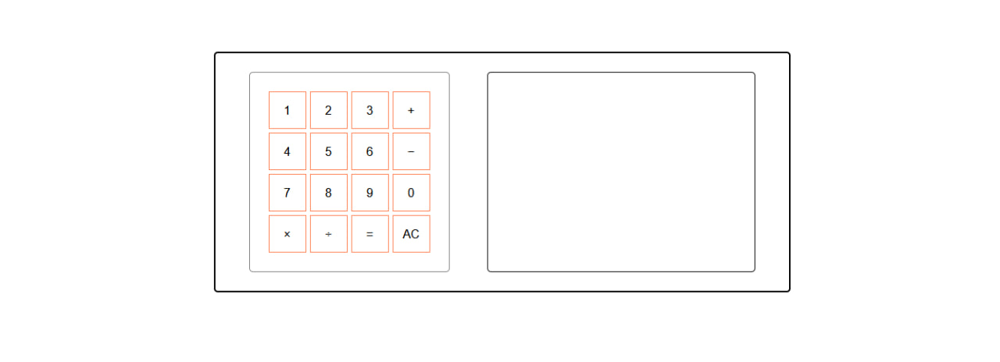

# 🧮 Vanilla JS Calculator

A simple **calculator built with pure HTML, CSS, and JavaScript**.  
Supports basic arithmetic operations and features a responsive layout for mobile devices.

---

## 🚀 Live Demo
👉 [Open Calculator](https://lsteelanxietyl.github.io/vanilla-js-calculator/)

---

## ✨ Features
- ➕ Addition  
- ➖ Subtraction  
- ✖️ Multiplication  
- ➗ Division  
- 📱 Responsive design (switches to column layout on screens ≤600px)  
- ⚡ Built without frameworks or libraries  

---

## 📸 Screenshot
  

---

## 🛠 Technologies
- HTML5  
- CSS3 (Flexbox, Grid + Media Queries)  
- JavaScript (ES6)  

---

## 📂 Installation & Usage
1. Clone the repository:
   ```bash
   git clone https://github.com/YOUR_USERNAME/vanilla-js-calculator.git
